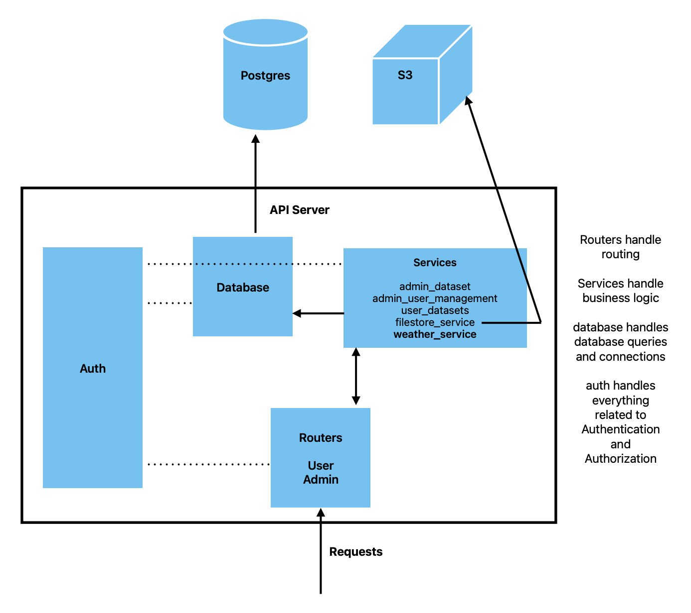

# Developer's Guide

This guide provides an overview of the DataIO architecture and codebase structure for new contributors. It will help you understand how the different components work together and how to set up your development environment.

## Architecture Overview

DataIO follows a layered architecture pattern with clear separation of concerns. The diagram below shows the high-level architecture:



### Request Flow

When a client makes a request to the API:

1. **Request Entry** - HTTP requests arrive at the API server
2. **Router Layer** - Routes the request to the appropriate endpoint handler
3. **Authentication** - Validates API keys and determines user permissions
4. **Service Layer** - Executes business logic for the requested operation
5. **Database Layer** - Handles database queries and connections
6. **External Systems** - Interacts with PostgreSQL database and S3 storage
7. **Response** - Returns data back through the layers to the client

## Core Components

### 1. Routers

**Location**: `src/dataio/api/routers/`

Routers handle HTTP request routing and endpoint definitions. They are responsible for:
- Defining API endpoints and HTTP methods
- Request/response validation using Pydantic models
- Delegating business logic to service layer
- Handling HTTP-specific concerns (status codes, headers, etc.)

#### User Router (`user.py`)

Handles user-facing endpoints for accessing and downloading datasets:
- `GET /api/v1/datasets` - List available datasets
- `GET /api/v1/datasets/{dataset_id}/{bucket_type}/tables` - List tables in a dataset
- `GET /api/v1/datasets/{dataset_id}/{bucket_type}/{table_id}` - Download a specific table
- `GET /api/v1/weather/*` - Weather data endpoints

**Example**:
```python
@user_router.get("/datasets")
async def get_datasets(
    limit: int = Query(100, ge=1, le=100),
    user: User = Depends(get_user),
    user_service: UserService = Depends(UserService),
):
    logger.info(f"CATALOGUE_VIEW_REQUEST: {user.email}")
    return user_service.get_user_datasets(user, limit)
```

#### Admin Router (`admin.py`)

Handles administrative endpoints for managing datasets, users, and permissions:
- Dataset creation, updates, and deletion
- User management and permission assignment
- Bulk operations and administrative tasks

### 2. Services

**Location**: `src/dataio/api/services/`

Services contain the business logic of the application. They:
- Process data and implement business rules
- Coordinate between multiple data sources
- Handle complex operations that span multiple database queries
- Manage external service interactions (S3, etc.)

All services inherit from `BaseService` which provides common functionality like logging.

#### User Service (`user_service.py`)

Handles user-facing operations:
- Retrieving datasets with permission filtering
- Generating presigned S3 URLs for downloads
- Managing user access to preprocessed data

#### Admin Dataset Service (`admin_dataset_service.py`)

Manages dataset lifecycle:
- Creating and updating datasets
- Managing dataset metadata
- Handling dataset relationships (collections, tags, etc.)

#### Admin User Management Service (`admin_user_management_service.py`)

Handles user administration:
- Creating and managing user accounts
- Assigning and revoking permissions
- Managing API keys

#### Filestore Service (`filestore_service.py`)

Manages file storage operations:
- Generating presigned S3 URLs for secure downloads
- Handling file uploads and retrievals
- Managing bucket access

#### Weather Service (`weather_service.py`)

Specialized service for weather data:
- Retrieving weather datasets and metadata
- Managing weather-specific data access patterns
- Handling weather data downloads

### 3. Database Layer

**Location**: `src/dataio/api/database/`

The database layer provides abstraction for all database operations.

#### Database Configuration (`config.py`)

Manages database connections using SQLAlchemy:
- Reads credentials from environment variables
- Creates database engine and session factory
- Connection pooling and management

**Example**:
```python
DATABASE_URL = f"postgresql://{DB_USER}:{DB_PASSWORD}@{DB_HOST}:{DB_PORT}/{DB_NAME}"
engine = create_engine(DATABASE_URL)
Session = sessionmaker(bind=engine)
```

#### Database Models (`models.py`)

SQLAlchemy ORM models representing database tables:
- `User` - User accounts and API keys
- `Dataset` - Dataset metadata and configuration
- `Collection` - Groupings of related datasets
- `RawDataset` - Source data references
- `DataOwner` - Ownership and contact information
- `UserPermission` - Fine-grained access control

#### Database Functions (`functions.py`)

Utility functions for common database operations:
- Query builders for complex operations
- Transaction management helpers
- Data retrieval and manipulation functions

#### Enumerations (`enums.py`)

Database enum types:
- `AccessLevel` - NONE, VIEW, DOWNLOAD
- `SpatialResolution` - Geographic resolution levels
- `BucketType` - STANDARDISED, PREPROCESSED
- Other domain-specific enumerations

### 4. Authentication & Authorization

**Location**: `src/dataio/api/auth/`

The auth system handles all security concerns:
- API key validation
- User identification
- Permission checking
- Role-based access control

#### Authentication Providers (`providers.py`)

Handles user authentication:
- Validates API keys from request headers
- Retrieves user information from database
- Provides `get_user()` dependency for FastAPI routes

#### Authorization & Permissions (`permissions.py`)

Implements permission checking:
- `determine_user_permissions()` - Calculates effective permissions for a user
- `user_has_dataset_download_access()` - Checks download permissions
- `require_admin()` - Validates admin access
- Resource-level permission checks (dataset, collection, bucket)

#### Decorators (`decorators.py`)

Provides convenient decorators for route protection:
- `@admin_required` - Restricts endpoint to admin users

**Example**:
```python
@admin_required
@admin_router.post("/datasets")
async def create_dataset(user: User = Depends(get_user)):
    # Only admins can access this
    pass
```

#### Exceptions (`exceptions.py`)

Custom exception types for auth errors:
- `AuthenticationError` - Invalid or missing credentials
- `AuthorizationError` - Insufficient permissions

### 5. API Models

**Location**: `src/dataio/api/models.py`

Pydantic models for request/response validation:
- Request body schemas
- Response schemas
- Data transfer objects (DTOs)
- Input validation and serialization

These models ensure type safety and automatic API documentation.

### 6. External Systems

#### PostgreSQL Database

Primary data store containing:
- User accounts and credentials
- Dataset metadata and relationships
- Permission mappings
- Configuration data

#### S3 Storage

Object storage for actual dataset files:
- CSV/Parquet data files
- Shapefiles and geospatial data
- Generated reports and exports

Access is managed through presigned URLs generated by the Filestore Service.

## Database Setup

DataIO includes scripts to set up your PostgreSQL database for local development.

### Prerequisites

1. Install PostgreSQL (version 12 or higher)
2. Create a `.env` file with database credentials:

```bash
DB_USER=your_username
DB_PASSWORD=your_password
DB_HOST=localhost
DB_PORT=5432
DB_NAME=dataio
MIGRATIONS_DIR=src/dataio/db/migrations
```

### Option 1: Full Setup (Recommended for Development)

Use this script to create the database with sample data and test users:

```bash
bash ./src/dataio/db/init/recreate_full.sh
```

This script will:
1. Drop the existing database if it exists
2. Create a new database from scratch
3. Apply all migrations from `src/dataio/db/migrations/` in order
4. Insert sample datasets using `src/dataio/db/init/insert_datasets.py`
5. Create test users with API keys using `src/dataio/db/init/users.py`

Test API keys will be generated in `src/dataio/db/init/data_inserts/` folder. You can use these for testing the API.

### Option 2: Schema Only

Use this script if you want just the database schema without sample data:

```bash
bash ./src/dataio/db/init/recreate.sh
```

This script will:
1. Drop the existing database if it exists
2. Create a new database from scratch
3. Apply all migrations from `src/dataio/db/migrations/` in order

Use this option when you want to:
- Manually insert your own data
- Test migrations without sample data
- Set up a clean production-like environment

### Database Migrations

All database schema changes must be versioned as migration scripts in `src/dataio/db/migrations/`. Migrations are applied in lexicographic order, so name them appropriately (e.g., `001_initial_schema.sql`, `002_add_weather_tables.sql`).

**Migration best practices**:
- Use transaction blocks (`BEGIN; ... COMMIT;`)
- Include rollback instructions as comments
- Test migrations on a copy of production data
- Always update `src/dataio/db/schema.sql` to reflect current state

**Example migration**:
```sql
BEGIN;

-- Migration: Add weather data tables
-- Date: 2024-01-15

CREATE TABLE weather_datasets (
    id SERIAL PRIMARY KEY,
    name VARCHAR(255) NOT NULL,
    created_at TIMESTAMP DEFAULT CURRENT_TIMESTAMP
);

-- Rollback instructions:
-- DROP TABLE weather_datasets;

COMMIT;
```

## Running the API Server

After setting up the database, start the API server:

```bash
# Development mode with auto-reload
uv run fastapi dev src/dataio/api

# With structured logging
uvicorn src.dataio.api.main:app --log-config log_config.yml --reload
```

The API will be available at:
- Interactive API docs: http://localhost:8000/api/v1
- Project documentation: http://localhost:8000/docs

## Development Workflow

### 1. Making Changes

1. **Routers**: Add new endpoints or modify existing ones
   - Define route, HTTP method, and parameters
   - Add authentication/authorization dependencies
   - Delegate to service layer

2. **Services**: Implement business logic
   - Keep routers thin, services fat
   - Use database functions for queries
   - Handle errors and edge cases

3. **Database**: Modify schema through migrations
   - Create new migration file
   - Test migration thoroughly
   - Update schema.sql

4. **Auth**: Modify permissions or add new access controls
   - Update permission checking functions
   - Add new permission types if needed
   - Update database models

### 2. Testing

Run tests using pytest:

```bash
# Run all tests
pytest src/dataio/api/tests/

# Run specific test file
pytest src/dataio/api/tests/test_api.py

# Run specific test
pytest src/dataio/api/tests/test_api.py::test_function_name
```

Tests use environment variables for API keys:
- `TEST_ADMIN_KEY` - Admin user key
- `TEST_ANALYST_KEY` - Analyst user key
- `TEST_PUBLIC_KEY` - Public user key
- `TEST_EXT_COLLABORATOR_KEY` - External collaborator key

### 3. Code Style

- Follow PEP 8 style guidelines
- Use type hints for function parameters and return values
- Write docstrings for public functions and classes
- Keep functions focused and single-purpose

## Project Structure

```
dataio/
├── src/dataio/
│   ├── api/                    # API server code
│   │   ├── main.py            # FastAPI application entry point
│   │   ├── models.py          # Pydantic request/response models
│   │   ├── routers/           # API endpoint definitions
│   │   │   ├── user.py        # User-facing endpoints
│   │   │   └── admin.py       # Admin endpoints
│   │   ├── services/          # Business logic layer
│   │   │   ├── user_service.py
│   │   │   ├── admin_dataset_service.py
│   │   │   ├── admin_user_management_service.py
│   │   │   ├── filestore_service.py
│   │   │   └── weather_service.py
│   │   ├── database/          # Database layer
│   │   │   ├── config.py      # Database connection
│   │   │   ├── models.py      # SQLAlchemy ORM models
│   │   │   ├── functions.py   # Database utilities
│   │   │   └── enums.py       # Database enumerations
│   │   └── auth/              # Authentication & authorization
│   │       ├── providers.py   # Authentication providers
│   │       ├── permissions.py # Permission checking
│   │       ├── decorators.py  # Auth decorators
│   │       └── exceptions.py  # Auth exceptions
│   ├── sdk/                   # Python SDK for users
│   │   ├── user.py           # User SDK
│   │   └── admin.py          # Admin SDK
│   └── db/                    # Database management
│       ├── migrations/        # Versioned schema migrations
│       ├── init/             # Database initialization scripts
│       ├── dump/             # Backup utilities
│       └── schema.sql        # Current database schema
├── docs/                      # Documentation
│   ├── source/               # Documentation source files
│   └── build/                # Built documentation
└── tests/                    # Test files
```

## Next Steps

- Read the [Contributing Guide](CONTRIBUTING.md) for code contribution guidelines
- Check out the [API Reference](apidocs/index.rst) for detailed API documentation
- Review existing code in the routers and services to understand patterns
- Set up your development environment and run the test suite
- Start with small changes to familiarize yourself with the codebase

## Getting Help

If you have questions or run into issues:
- Check the existing documentation
- Look at similar implementations in the codebase
- Review test files for usage examples
- Contact the maintainers for guidance

Happy coding!
